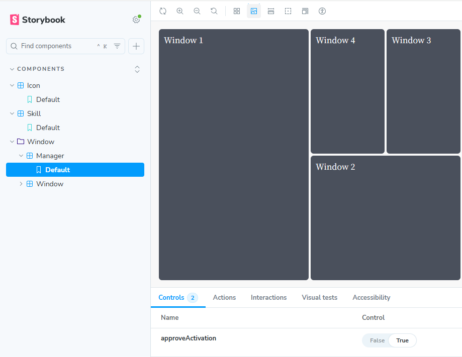

# ポートフォリオ3

https://tkhs-0114.github.io/portfolio3/

## 説明

夏休みに参加した経験を活かして作成した3個目のポートフォリオサイト。2個目のポートフォリオはUbuntuっぽいデザインを意識して作ったので今回はHyprland風（？なのかな？）のデザインで作成してみた。が、正直デザイン的にはイマイチ

## よかった点

- StoryBookを活用してコンポーネントを作成できた
- FlexBoxを使用した。
- 前回（ポートフォリオ2）の反省点だったマージ時の自動デプロイを実装できた

## 反省点

- GitHubFlowで開発を行ったが、マージ時に自動デプロイされてしまうのでGitFlowの方が相性が良さそうだと感じた。
- FlexBoxを使うべき点とそうじゃない点をしっかりと区別する必用があると感じた。
- デザインがとにかくイマイチ。タイル型ウィンドウマネージャー風を意識して作成したが、一画面に情報を詰め込みすぎで見にくい。
- アニメーションをもっと活用できるようになりたい。タイル型WMが開く時は順番に開いていく求めていたアニメーションを実装することができたが、閉じる時はその逆順のようなアニメーションを作りたかった。（タイル型をコンポーネントで作成し再帰的な処理にしているのがそもそもの間違いな気がする）
- ポートフォリオ提出日（2025/10/05）時点で未完成な点。もっと高速に開発できるようになりたい。

## 総括

- 前回（ポートフォリオ2）の反省点にもあったUXをまったく改善できていないのは良くない
- StoryBookや自動デプロイ等、開発の経験としてはとても学びになった。
- **次に生かしたい**
